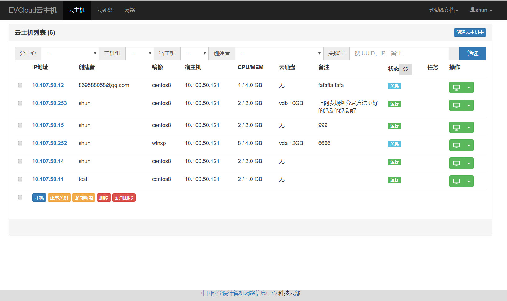

## 关于EVCloud

> EVCloud是一个轻量级云主机管理平台，追求功能实用，运行稳定，维护简单，由中国科学院计算机网络信息中心，科技云部团队负责研发。
主要技术栈：CEPH、MySQl、Django、libvirt。

### 展示



## 环境搭建(CentOS7)
### 1 安装python和Git
请自行安装python3.6和Git。
使用Git拉取代码： 
```
git clone https://github.com/evcloud/evcloud_dev.git
```
### 2 安装python运行环境
#### （1） 使用python虚拟环境
使用pip命令安装pipenv。  
```
pip3 install pipenv
```
在代码工程根目录下，即文件Pipfile同目录下运行命令：  
```
pipenv install
```
#### （2） 使用系统python环境
在代码工程根目录下，即文件requirements.txt同目录下运行命令：  
```pip3 install -r requirements.txt```

### 3 安全敏感信息配置文件
安全信息配置demo文件security_demo.py修改文件名为security.py，根据自己情况完成配置。

### 4 数据库安装
请自行安装mysql数据库，根据自己的情况修改security.py文件中数据库的配置项。 
  ```
DATABASES = {
    'default': {
        'ENGINE': 'django.db.backends.mysql',  # 数据库引擎
        'NAME': 'xxx',  # 数据的库名，事先要创建之
        'HOST': '127.0.0.1',  # 主机
        'PORT': '3306',  # 数据库使用的端口
        'USER': 'xxx',  # 数据库用户名
        'PASSWORD': 'xxx',  # 密码
        'OPTIONS': {'init_command': "SET sql_mode='STRICT_TRANS_TABLES'"}
    },
}
```   

### 5 CEOPH依赖库安装
与ceph的通信默认使用官方librados的python包python36-rados，python36-rbd的rpm包安装成功后，python包会自动安装到
系统python3第三方扩展包路径下（/usr/lib64/python3.6/site-packages/）。    
使用python虚拟环境的，需要手动把路径下的python包文件rados*和rbd*复制到你的虚拟python环境*/site-packages/下。
```
yum install -y http://download.ceph.com/rpm-nautilus/el7/x86_64/librados2-14.2.1-0.el7.x86_64.rpm
yum install -y http://download.ceph.com/rpm-nautilus/el7/x86_64/python36-rados-14.2.1-0.el7.x86_64.rpm
yum install -y http://download.ceph.com/rpm-nautilus/el7/x86_64/python-rbd-14.2.4-0.el7.x86_64.rpm
```

### 6 运行服务
如果使用python虚拟还击，先激活python虚拟环境  
```
pipenv shell
```    
数据库迁移,在项目根目录下运行如下命令完成数据库迁移。  
```
python manage.py migrate
```
运行web服务  
```
python manage.py runserver 0:80
```   
如果一切正常，打开浏览器输入url(主机IP, 如：127.0.0.1)即可查看站点;

### 7 NoVNC服务
安装websockify
```
pip3 install websockify
```
替换websockify的token插件，使用项目中自定义的token插件，根据自己环境修改以下命令中的PROJECT_PATH和PYTHON_PATH：
```
ln -s PROJECT_PATH/novnc/plugin_mysql_token/token_plugin_mysql.py PYTHON_PATH/python3.6/site-packages/websockify/token_plugins.py
```
启动websockify服务
```
websockify 0.0.0.0:84 --daemon --web=/usr/share/novnc --token-plugin=TokenMysql --token-source='mysql'
```
请对应设置项目配置文件settings.py中参数NOVNC_SERVER_PORT的值。


## 关于我们
中国科学院计算机网络信息中心，科技云部。
